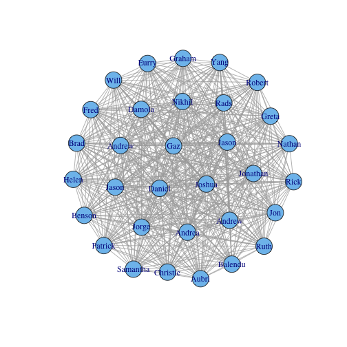
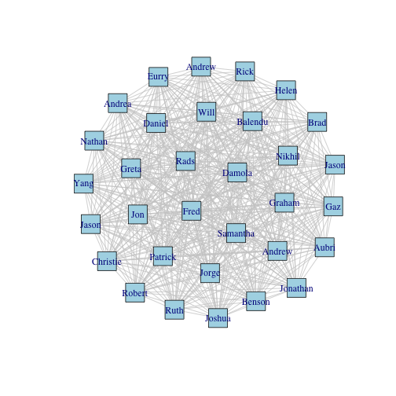
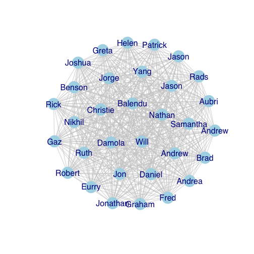

# Hi Princeton.

### I'm Eurry.

<small> [@instagram](http://instagram.com/eurryPlot) | [@twitter](http://twitter.com/eurryPlot) </small>

---

# Facebook
## Marketing Science


---

## Today's Agenda

<br>
- Graphic principles
- What is network data
- Analyze my Facebook social network
  1. In [R](http://www.r-project.org/)
  <br>
     a. A little Illustrator 
  2. In [Gephi](http://gephi.github.io/)
- Review social TV conversation data from Facebook

--- &vertical

# The 2012 Presidential Election

*** 

## Gallup


***

## NY Times


--- &vertical

# Tufte Principles for Graphical Excellence

***

## 1. Show the data

<br>

.fragment But which data?

<!--
  1. Answer the "so what" question
  2. Know when to throw data away
- ≠ "let the data speak for itself"
-->

***

## 2. Induce the viewer to think about the substance

<br>

.fragment Design taken for granted

<!--
- Define the "so what" question
   1. Answer-driven form
   2. Ease comprehension
   3. Leverage existing knowledge
-->

***

## 3. Avoid distorting what the data have to say

<br>

.fragment Clarity

<!--
- The right medium
- Convey the message
-->

***

## 4. Present many numbers in a small space

<br>

.fragment Data density

<!--
- Think most "infographics"
- Show relationships
- Encourage questions
- Small multiples are great here
-->

***

## 5. Make large data sets coherent

<br>

.fragment The right metrics

<!--
  1. Patterns
  2. Correlations
  3. Probabilities
  4. Distributions
 -->

***

## 6. Encourage the eye to compare different pieces of data

<br>

.fragment Color, shape, and layout

***

## 7. Reveal the data at several levels of detail

<br>

.fragment The right data cuts

<!--
  1. Gallup > Party, voter likelihood
  2. NY Times > Party, state
-->

***

## 8. Serve a reasonably clear purpose 

<br>
> Not everything that counts can be counted, and not everything that can be counted counts.

<br>

<cite>Einstein</cite>

***

## 9. Be closely integrated with the statistical and verbal descriptions of a data set.

<!--
- Reasonable takeaways
- Logical relationships
- Statistically valid inferences
-->

---

# Network data

## nodes / actors / people
  
## edges / ties / relationships

---

## Cleveland, W.S. (2001)

An [action plan](http://flowingdata.com/2012/02/03/an-action-plan-for-data-science-a-decade-ago/) for data science 


--- &vertical

## Let's check out my network of Facebook friends


<!--
- Clean data is not easy to come by in the "real world"
  - I had to run 4 Hive queries
-->

---
## Read in the datasets


```r
# Install package

## Not run: install.packages("igraph")
library(igraph)

# Read in edgelist
eurry.el <- read.csv("datasets/eurry_fb_network.csv", header = TRUE)

# Read in name to ID mappings
id.map <- read.csv("datasets/friend_names.csv", header = TRUE, stringsAsFactors = FALSE)

library(pander)
pander(id.map[1,])
```

```
## 
## ---------------------
##  userid    firstname 
## --------- -----------
## 500058493    Eurry   
## ---------------------
```

--- &vertical

# 90% of the job

.fragment Cleaning/prepping data

.fragment #sorrynotsorry

***

## Turn data.frames into graph objects


```r
# Turn edgelist into graph object
eurry.graph <- graph.data.frame(eurry.el, vertices = id.map, directed = FALSE)

# Check object type
class(eurry.graph)
```

```
## [1] "igraph"
```

```r
# Simplify the edgelist
eurry.graph2 <- simplify(eurry.graph, remove.multiple = TRUE, remove.loops = TRUE)
```

<br>

.fragment Wait. What's an edgelist?

*** 

## An edgelist

<br>

<table style="width:400px; margin-left: auto; margin-right: auto;">
  <tr>
    <td><strong>fbPerson</strong></td>
    <td><strong>fbFriend</strong></td>
  </tr>
  <tr>
    <td>Eurry</td>
    <td>Dan</td>
  </tr>
  <tr>
    <td>Eurry</td>
    <td>Neha</td>
  </tr>
  <tr>
    <td>Eurry</td>
    <td>Sam</td>
  </tr>
  <tr>
    <td>Eurry</td>
    <td>Jorge</td>
  </tr>
  <tr>
    <td>Eurry</td>
    <td>Jerry</td>
  </tr>
  <tr>
    <td>Eurry</td>
    <td>Alva</td>
  </tr>
  <tr>
    <td>Eurry</td>
    <td>Damola</td>
  </tr>
  <tr>
    <td>Dan</td>
    <td>Annie</td>
  </tr>
  <tr>
    <td>Dan</td>
    <td>Neha</td>
  </tr>
</table>

***

## Check the data 


```r
me <- get.vertex.attribute(eurry.graph2, name = "firstname")[1]
pander(me)
```

```
## Eurry
```

```r
# Assign vertex labels
V(eurry.graph2)$name <- get.vertex.attribute(eurry.graph2, name = "firstname")
```

---

## Some network diagnostics


```r
# How many edges?
ecount(eurry.graph2)
```

```
## [1] 6228
```

```r
# How many vertices?
vcount(eurry.graph2)
```

```
## [1] 565
```

```r
# Fewest ties to get from one person to another?
diameter(eurry.graph2)
```

```
## [1] 2
```

```r
# Collect largest cliques in my network
lc <- largest.cliques(eurry.graph2)
```

---

## The largest clique in my Facebook social network


```r
# Plot my largest clique
plot(induced.subgraph(eurry.graph2, lc[[1]]), 
     layout=layout.fruchterman.reingold)
```

 

---

## Change some visual attributes


```r
plot(induced.subgraph(eurry.graph2, lc[[1]]), 
     layout=layout.fruchterman.reingold,
     edge.color = "gray80",
     vertex.color = "light blue",
     vertex.size = 5.0)
```

 

---

## Assign attributes to vertices


```r
V(eurry.graph2)$color <- "light blue"
V(eurry.graph2)$vertex.size <- 7.0
V(eurry.graph2)$shape <- "square"
plot(induced.subgraph(eurry.graph2, lc[[1]]), 
     layout=layout.fruchterman.reingold, 
     edge.color = "gray80")
```

 

---

## Smaller circles look better


```r
# Not run: V(eurry.graph2)$color <- "light blue"
# Not run: V(eurry.graph2)$vertex.size <- 7.0
V(eurry.graph2)$shape <- "circle"
V(eurry.graph2)$frame.color <- "transparent"
plot(induced.subgraph(eurry.graph2, lc[[1]]), 
     layout=layout.fruchterman.reingold, 
     edge.color = "gray80",
     vertex.size = 7.0)
```

 

---

## Export as postscript


```r
postscript("visuals/eurry_largest_clique.eps", fonts=c("sans", "Helvetica"))
plot(induced.subgraph(eurry.graph2, lc[[1]]), 
     layout=layout.fruchterman.reingold, 
     vertex.label.family="sans",
     edge.label.family="Helvetica", 
     vertex.label.cex=1,
     edge.label.cex=2, 
     edge.color = "gray80")
dev.off()
```

 

```
## RStudioGD 
##         2
```

---

## Adobe Illustrator plays well with eps files


---

## Vector-based graphics

### Select > Same > Appearance


---

## Vector-based graphics

### Select > Object > Text Objects


---

## Not bad huh?


---

## My entire Facebook social network


```r
plot(eurry.graph2,
     layout=layout.fruchterman.reingold, 
     vertex.size = 2.0, 
     vertex.color = "dark blue",
     vertex.label = NA)
```

 

---

## Prepare data for Gephi


```r
eurry.el.gephi <- eurry.el
colnames(eurry.el.gephi) <- c("Source","Target")
write.table(eurry.el.gephi, file = "datasets/eurry_fb_network_gephi.csv", sep = ",", quote = FALSE)
```

---

## Load the edgelist


---

## Play around


---

## Social TV Conversations on Facebook


```r
fb.socialtv <- read.csv("datasets/fb_socialtv_3july.csv", header = TRUE, stringsAsFactors = FALSE)
head(fb.socialtv)
```

```
##   channel_name series_name parent_convo_type
## 1          ABC   Black Box              like
## 2          ABC   Black Box              like
## 3          ABC   Black Box              like
## 4          ABC   Black Box              like
## 5          ABC   Black Box              like
## 6          ABC   Black Box              like
##                    parent_convo_id child_convo_type child_convo_id
## 1 afb665ae093f7ad70dfb27ec25858d8e                                
## 2 667f9c3edd2c6a2839252fd50ba341c4                                
## 3 a72b9d5c27dd710d02b551810e73db71                                
## 4 4f74057d759dcaa3f3151abf25ff7a0f                                
## 5 7012711de9181d3d1d65f57148795ea1                                
## 6 a3ce4c7ff3fc2491990039359bb147bf
```

---

## About the dataset


```r
table(fb.socialtv$parent_convo_type, fb.socialtv$child_convo_type)
```

```
##          
##                  comment   like
##   comment  44014      11  64625
##   like    215968    5518  16317
##   link      1431    2791   5070
##   photo     1671   14864  53260
##   reshare   1009    1622   4916
##   video       42     420   1046
```

--- 

## Data definitions

Think about how Facebook conversations happen.

> - Starts with a post containing link, photo, or video
> - Friends can like, comment, or reshare that content
> - Friends can like those comments or those reshares

---

# Recap & Takeaways

- Iterate, iterate, iterate
- Refer back to Tufte's principles for graphic excellence
- Be inspired by other work
- How would you visualize better?

---

# Resources

- [FlowingData.com](http://flowingdata.com/)
- [JunkCharts](http://junkcharts.typepad.com/)
- [Stephen Few](http://www.perceptualedge.com/blog/)
- [ProPublica](http://www.propublica.org/tools/)
- [Edward Tufte](http://www.edwardtufte.com/tufte/)
- [D3](https://github.com/mbostock/d3/wiki/Gallery)

---

# Thanks

This presentation was produced in [RStudio](http://www.rstudio.com/) thanks to the [slidify](http://ramnathv.github.io/slidify/) package and the [revealjs](http://lab.hakim.se/reveal-js/#/) framework. It was typeset in [Quicksand](https://www.google.com/fonts/specimen/Quicksand) and [Raleway](https://www.google.com/fonts/specimen/Raleway). 
